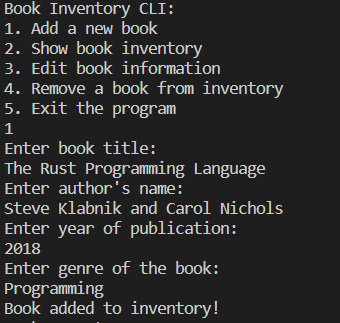
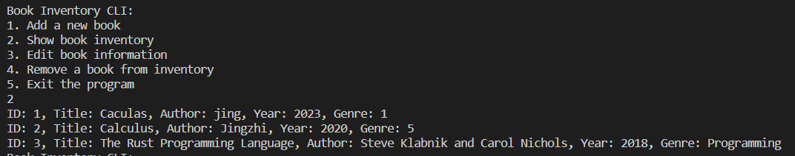
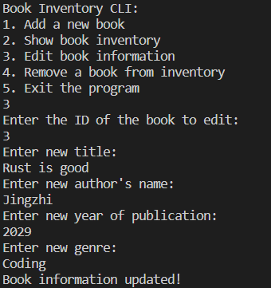
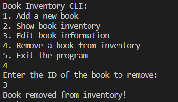
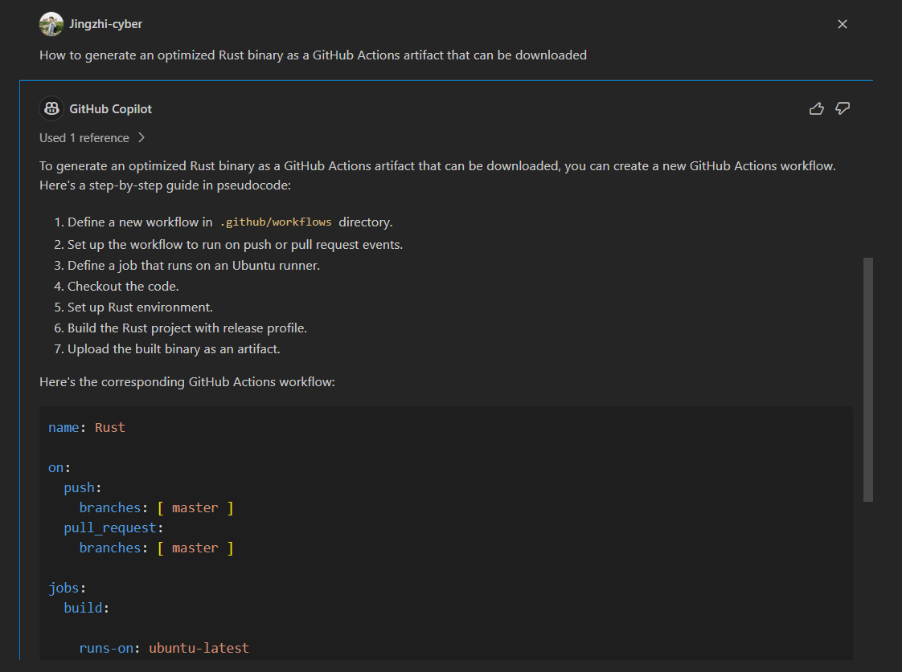

# IDS706-Project2: Rust CLI for Book Inventory Management
[](https://github.com/Jingzhi-cyber/jz422-IDS706-Individual-Project2/actions/workflows/rust.yml)

This is a command-line interface (CLI) application written in Rust that provides a simple interface for managing a book inventory using SQLite. It allows users to add, list, update, and delete book records in a SQLite database.

## YouTube Introduction Vedio
A video demonstration of the CLI in action is available [here](https://youtu.be/Cst8zGjD7sU). This video provides a walkthrough of the project's features and demonstrates how to interact with the CLI.


## Features

- Add new book records to the inventory.

  

- List all books in the inventory with details.

  

- Update existing book records by ID.

  

- Remove book records from the inventory by ID.

  

- Persistent storage with SQLite database.

- Error handling to ensure robustness.


## Dependencies

To run this project, you will need Rust and Cargo installed on your system. You can install these from the [official Rust website](https://www.rust-lang.org/tools/install).

Additionally, this project uses the `rusqlite` crate for interacting with the SQLite database. This dependency is listed in the `Cargo.toml` file and will be automatically handled by Cargo.


## How to Run the Program

1. Clone the repository to your local machine.
2. Navigate to the project directory in your terminal.
3. Build the project using Cargo:
    ```bash
    cargo build --release
    ```
4. Run the compiled binary:
    ```bash
    cargo run --release
    ```
5. Follow the on-screen prompts to interact with the book inventory.


## Using GitHub Copilot

Throughout the development of this application, GitHub Copilot was used extensively. Copilot provided code suggestions and snippets that helped speed up the implementation process. Specifically, Copilot assisted with:

- SQL query syntax.
- Rust function and error handling patterns.
- Test case generation for unit tests.



Instructions for how to enable and use GitHub Copilot can be found in its [official documentation](https://docs.github.com/en/copilot).


## GitHub Actions

This project includes a GitHub Actions workflow that automatically builds, tests, and lints the code on every push to the repository. The workflow is defined in the `.github/workflows/rust.yml` file.

## Optimized Rust Binary

The GitHub Actions workflow is configured to produce an optimized Rust binary as an artifact. After each successful build on the `main` branch, the binary is available for download from the GitHub Actions run.

In order to produce an optimized Rust binary, you should use the --release flag when building:

    cargo build --release

This command will generate an optimized binary file in the target/release/ directory.


## Project Structure
- **.devcontainer** includes a Dockerfile and devcontainer.json. The **Dockerfile** within this folder specifies how the container should be built, and other settings in this directory may control development environment configurations.
- **.github/workflows/rust.yml** contains the GitHub Actions workflow. It defines CI/CD steps that automatically builds, tests, and lints the code on every push to the repository
- **.gitignore** is used to specify which files or directories should be excluded from version control when using Git.
- **README.md** is the instruction file for the readers.
- **src/main.rs** is the main entry point for this Rust application. It contains the logic for starting your CLI application.
- **Cargo.toml** is the manifest file for Rust. It includes metadata about the project like the name, version, authors, and also lists the project's dependencies.
- **Cargo.lock** is generated by Cargo and contains a complete, exact list of the dependencies used in your project, including all version numbers. This ensures that the project is reproducible on other machines.
- **images** contains the demo images for this Rust CLI application.


